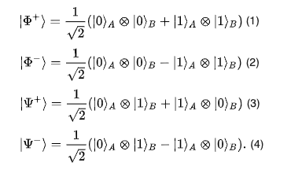

# Measurements
This repo is about measurements in quantum circuits and quantum computation. Measurements can be understood in many ways, we will primarily use linear algebra to interpret quantum circuit diagrams such as in the [Qubit Rotation Tutorial](https://github.com/The-Singularity-Research/Video1-Qubit-Rotation). We will discuss measurements in different bases and with various kinds of operators. We will also look at "expectation values", and we will provide PennyLane code to reproduce the calculations on actual quantum computers as well as on simulation devices. 

---
## Measurement
The [Measurement Tutorial](https://github.com/The-Singularity-Research/Measurements/blob/master/Measurement_Tutorial.pdf) gives examples of the basic linear algebra behind [measurements](https://en.wikipedia.org/wiki/Measurement_in_quantum_mechanics) and [expectation values](https://en.wikipedia.org/wiki/Expectation_value_(quantum_mechanics)). The interactive version of the notebook for [Expectation Values](https://mybinder.org/v2/gh/The-Singularity-Research/Measurements/1f214d9a5be816697dd87333f2a0b656d41ee331?filepath=measurements.ipynb) can be found on Binder. 

---
## Bell States, Entanglement, and the EPR-Paradox
The Bell States Notebook can be viewed in the [Jupyter nbviewer](https://nbviewer.jupyter.org/github/The-Singularity-Research/Measurements/blob/master/Bell_states.ipynb) or in an interactive format on [Binder](https://mybinder.org/v2/gh/The-Singularity-Research/Measurements/dd9880ab3d8c66b7d484bf96a3c0742e476b693e?filepath=Bell_states.ipynb). This notebook looks at the how one can create different initial basis states: 

and then run a quantum circuit that creates the four Bell states: 

It also shows how to compute multiple-shot sampling of the Bell state that is created. [Bell states](https://en.wikipedia.org/wiki/Bell_state) are significant because they give on e of the most basic examples of [entanglement](https://en.wikipedia.org/wiki/Quantum_entanglement) and are one way of viewing the [EPR-paradox](https://en.wikipedia.org/wiki/EPR_paradox). They are important in [superdense coding](https://en.wikipedia.org/wiki/Superdense_coding) and [quantum teleportation](https://en.wikipedia.org/wiki/Quantum_teleportation).  
